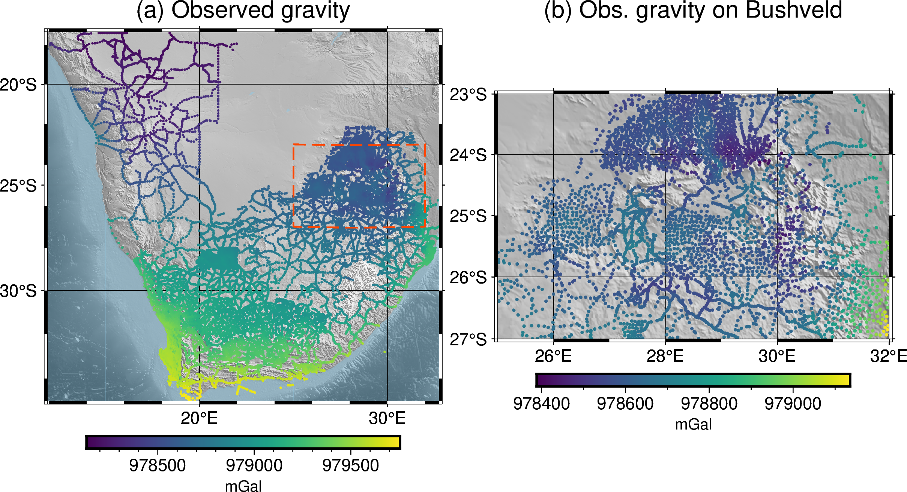
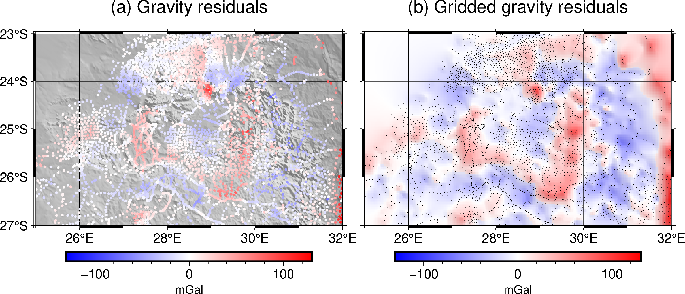

# Fatiando a Terra: Open-source tools for geophysics

[Santiago Soler](https://www.santisoler.com)<sup>1</sup>
[Lindsey J. Heagy](https://lindseyjh.ca/)<sup>1</sup>

> 1. Department of Earth, Ocean and Atmospheric Sciences, University of British
>    Columbia

## Summary

<!-- brief description of what the talk will be about -->

During this talk we will present the Fatiando a Terra project, a collection of
open-source Python libraries designed for geophysical applications.
We will describe how the project started as a simple library part of a PhD
Thesis in South America, how it created a community around it that actively
collaborates to its development and its current state.
We will introduce the tools available in the project and show real world
examples of how they can be used to solve geophysical problems.
Finally we will discuss some of the current challenges and mention the upcoming
features and development plans for the future.


## Introduction

<!-- something about geosciences and open source, the history and the need to
develop os tool for a more collaborative and reproducible science -->

The relation between geophysical research and computational solutions dates
back to the very origins of silicon-based computers.
Scientists and industry saw in computational power a mean to solve new
challenging problems within geosciences and exploration.
They offer the possibility to process large amount of data, generate
visualizations for interpretation and ultimately to perform inversions to build
models of the subsurface. All of which are key to improve decision making
processes.

Companies and researchers started developing their own software to perform
these types of tasks.
Although most of them built in-house tools, the appearance of open-source
software for geosciences happened as early as the 70s and 80s.
Projects like Seismic Unix (Stockwell, 1999) and GMT (Wessel et al., 2019) are
pioneer examples.

Fast-forwarding to this millennia, the popularity that the Python language
developed among every scientific field planted the seed for an ever-growing
open-source geoscientific ecosystem.
Python tools aimed to solve geoscientific problems proliferated, specially
since the beginnings of the second decade of the century.

In this scenario Fatiando a Terra (Uieda et al., 2013;
https://www.fatiando.org) was born: a project for developing open-source Python
tools for geophysics.
It started in 2010 in South America as a simple Python library as part of the
PhD Thesis of Leonardo Uieda, but due to its open-source license and good
online documentation it started being used by researchers and industry
consultants from different regions of the world.
As more people started to use it, some of them became contributors
by writing new features, fixing bugs, adding more test or improving the
documentation.
The open-source nature of the project allowed it to grow under
a community-driven development.

The main goal of the project is to to provide open-source software tools that
are easy to use and also well designed, tested and documented.
Nowadays it consists in a set of Python libraries for geosciences, each one of
them with a very specific scope of application.
They offer software solutions for downloading and caching data from the web,
handling and interpolating spatial data, computing normal gravity of reference
ellipsoids through analytic solutions, processing potential fields data through
frequency-domain filters, forward modelling gravity and magnetic fields of
different simple geometrical bodies and grid harmonic data with equivalent
sources.

During this talk we'll provide an overview of the tools available in the
project and demonstrate their functionalities using examples from research and
industry applications.


## The Project

In its origins, Fatiando a Terra consisted in a single Python library named
`fatiando` (https://legacy.fatiando.org) that used to host all the features
that the project offered.
After years of development this designed was proved to be flawed: its code base
grew too large for a single library, making it hard to maintain and extend its
functionalities. Moreover, it hosted a wide variety of functionalities: from
production ready tools up to toy problems meant to be used for educational
purposes.

In 2018 the project decided to redesign its code base by splitting the old
`fatiando` library into several smaller libraries, each one with a very
specific scope.
This simplifies both the adoption of the libraries and also their development.
Most users look for only a subset of the tools offered by the project, and
having them divided in libraries reduces the size of the libraries they depend
on.
As a side effect, anyone interested in changing the code of one of our
libraries now needs to familiarize with a smaller code base, making it easier
for the community to contribute to the project.

By that time the geoscientific Python ecosystem had already seen a major
growth.
Libraries like SimPEG (Cockett et al., 2015), GemPy (de la Varga et al., 2019),
pyGIMLi (Rücker et al., 2017) and ObsPy (Obspy, 2019) were already established
and providing scientists and industry with a wide range of tools for research
and exploration.
The project decided to invest on extending this growing geoscientific
ecosystem, rather than reinventing features already developed by other
packages.
The introduction of smaller and narrow scoped libraries allowed other projects
to use on them, avoiding having a single large dependency for only a portion of
its features.

The project is currently formed by five libraries: Verde, Boule, Harmonica,
Pooch and Ensaio.

### Verde

Verde hosts tools for spatial data processing, interpolation and gridding.
Its core interpolation methods are inspired by machine learning, hence its
interface reassembles the one of the popular Scikit-learn (Pedregosa et al.,
2011). Besides, it offers analysis tools that accompany the interpolators, like
trend removal, blocked or windowed operations, cross-validation, k-folding,
grid projection and more coordinates manipulation utilities.

### Boule

Boule is a very thin library that hosts classes for representing geodetic
reference ellipsoids for the Earth and for celestial bodies of the solar
system like the Moon, Mars, Venus and Mercury.
These classes also offer methods to perform coordinate conversions between
geodetic and geocentric spherical systems, and to compute the normal gravity
generated by these ellipsoids on any external point through a closed-form
analytic solution (Li and Götze, 2001).

### Harmonica

Harmonica offers functions and classes for processing and modelling gravity and
magnetic data.
It hosts functions for forward modelling the gravity fields of point sources,
rectangular prisms and also tesseroids (a.k.a spherical prisms).
It can perform gravity corrections from a simple Bouguer to a full terrain
correction through forward modelling digital elevation models with prisms.
Regular grids can be transformed using FFT-based filters like upward
derivative, upward continuation and reduction to the pole, among others.
It also offers ways to perform interpolation, gridding and upward continuation
through the equivalent sources technique.
Lastly, but not least, it can also read data stored in popular formats like
`.gdf` files provided by the ICGEM Calculation Service (Barthelmes, 2013) and
`.grd` files from Oasis Montaj©.

### Pooch

The most general purpose library in the project is Pooch, which offers an easy
to use interface for downloading and caching data from the web.
Originally designed for scientific applications and to be used by other
software packages, Pooch can download data from the web through a large range
of protocols, cache it locally at a desired location and also check the
integrity of those files.
This thin library is currently being used by other projects in the scientific
Python stack, like SciPy (Virtanen et al., 2020), scikit-image (van der Walt et
al., 2014), MetPy (May et al., 2016) and icepack (Shapero et al., 2020), among
others.

### Ensaio

Lastly we introduce Ensaio, a small library that hosts open licensed datasets
that are useful for running examples and tutorials, for teaching and for
probing our codes.
It actually uses Pooch under the hood to download and cache those datasets
locally so its codebase ends up being very slim.
All the gallery examples and user guides of Harmonica and Verde use Ensaio to
fetch the example datasets.

## Examples

With Ensaio we can easily grab some curated datasets. For example, let's
download a gravity dataset over Southern Africa (made available by NOAA NCEI):

```python
import ensaio
ensaio.fetch_southern_africa_gravity(version=1)
```

Figure 1 shows plots of the downloaded gravity data over Southern Africa, and
a cropped region focusing on the Bushveld Igneous Complex.


> Figure 1. Gravity data over Southern Africa:
> (a) observed gravity data and box delimiting the boundaries of a region that
> contains the Bushveld Igneous Complex, (b) observed data limited to the
> region around the Bushveld Igneous Complex.
> Data made available by NOAA NCEI and downloaded using Ensaio.

Using Boule we can define an object that represents the WGS84 reference
ellipsoid and use it to compute the normal gravity, i.e. the gravity
acceleration of the reference ellipsoid on every observation point:

```python
import boule as bl
ellipsoid = bl.WGS84
ellipsoid.normal_gravity(data.latitude, data.height)
```

By removing the normal gravity from the observed gravity we can obtain the
gravity disturbance (see Fig. 2a).


> Figure 2.
> (a) Gravity disturbance over the Bushveld Igneous Complex.
> (b) Bouguer gravity disturbance obtained after removing the terrain effect
> from the gravity disturbance.

In order to obtain the Bouguer gravity disturbance we need to remove the
terrain effect from the gravity disturbance we already computed.
Harmonica allows us to forward model the gravity effect of the topographic
masses on every observation point by approximating them with rectangular
prisms with a specified density (see Fig. 2b):

```python
import harmonica as hm
density = np.where(topography > 0, 2670, 1040 - 2670)
model = hm.prism_layer(
    coordinates=(topography.easting, topography.northing),
    surface=topography,
    reference=0,
    properties={"density": density},
)
terrain_effect = model.prism_layer.gravity(coordinates, field="g_z")
```

With the goal of obtaining the gravity effect of the shallower masses we need
to split the residual field from the regional field.
We can use Harmonica to generate the regional field using deep equivalent
sources (see Fig. 3a).

```python
deep_sources = hm.EquivalentSources(damping=1000, depth=500e3)
deep_sources.fit(coordinates, gravity_bouguer)
gravity_regional = deep_sources.predict(coordinates)
gravity_residual = gravity_bouguer - gravity_residual
```


> Figure 3.
> (a) Residual gravity field split using deep equivalent sources.
> (b) Gridded product of the residual gravity field at a constant height of
> 2200m above the ellipsoid.

In a similar way, we could use Harmonica's equivalent sources to grid the
residual field at a constant height (see Fig. 3b):

```python
eq_sources = hm.EquivalentSources(damping=10, depth=10e3)
eq_sources.fit(coordinates, gravity_residual)
grid = eq_sources.grid(
    upward=2200,
    spacing=grid_spacing,
)
```

The full code for running this example in addition with more detailed
explanation of the process can be found in https://www.fatiando.org/tutorials.


## Conclusions

<!-- How fatiando allowed a global community of collaborators to work together in -->
<!-- an open-source project. -->
<!-- Who are using fatiando and their achievements. -->
<!-- Future goals? -->

After more than a decade since them Fatiando a Terra project was born, the
project lives thanks to a network of collaborators and users that actively
participate in its development.
It keeps proving that a collaborative and community-driven software development
for science and industry is possible under an open-source environment.
Its development turns out to be useful not only for their direct users, but
also to the whole ecosystem: by providing tools that other projects can depend
on and by setting an example of how to develop and maintain open-source
geoscientific tools.

Fatiando has been used by students as researchers as core parts of their Thesis
and scientific articles, but also by the industry.
This highlights the importance of nursing open-source tools that people are
willing to invest time in learning and harnessing for their specific goals.

The future of the project expects exciting new features: a new magnetic forward
modelling functions are being developed for Harmonica along with new
types of equivalent sources and FFT-based transformations.
The inversion framework for the old `fatiando` library is missing in the new
tools, but we are looking forward to implement an improved one, focusing on
performing types of inversions that are missing in other packages of the
geophysical Python ecosystem.


## Acknowledgements

We are indebted to the developers and maintainers of all the open-source
software and particularly to the users and contributors of Fatiando a Terra.
Without their gratitude, effort and contributions this project
wouldn't exist.


## References

- Barthelmes, F. (2013). Definition of functionals of the geopotential and
  their calculation from spherical harmonic models: Theory and formulas used by
  the calculation service of the International Centre for Global Earth Models
  (ICGEM); http://icgem.gfz-potsdam.de/ICGEM/ ; revised edition. Scientific
  Technical Report; 09/02; ISSN 1610-0956.
  https://doi.org/10.2312/GFZ.B103-0902-26
- Cockett, R., Kang, S., Heagy, L. J., Pidlisecky, A., & Oldenburg, D. W.
  (2015). SimPEG: An open source framework for simulation and gradient based
  parameter estimation in geophysical applications. Computers & Geosciences,
  85, 142–154. https://doi.org/10.1016/j.cageo.2015.09.015
- Harris, C. R., Millman, K. J., van der Walt, S. J., Gommers, R., Virtanen,
  P., Cournapeau, D., Wieser, E., Taylor, J., Berg, S., Smith, N. J., Kern, R.,
  Picus, M., Hoyer, S., van Kerkwijk, M. H., Brett, M., Haldane, A., del Río,
  J. F., Wiebe, M., Peterson, P., … Oliphant, T. E. (2020). Array programming
  with NumPy. Nature, 585(7825), 357–362.
  https://doi.org/10.1038/s41586-020-2649-2
- Hoyer, S., & Hamman, J. (2017). xarray: N-D labeled Arrays and Datasets in
  Python. Journal of Open Research Software, 5(1), 10.
  https://doi.org/10.5334/jors.148
- Li, X., & Götze, H. (2001). Ellipsoid, geoid, gravity, geodesy, and
  geophysics. GEOPHYSICS, 66(6), Article 6. https://doi.org/10.1190/1.1487109
- May, R., Arms, S., Marsh, P., Bruning, E., Leeman, J., Bruick, Z., & Camron,
  M. D. (2016). MetPy: A Python Package for Meteorological Data.
  UCAR/NCAR-Unidata. https://doi.org/10.5065/D6WW7G29
- McKinney, W. (2010). Data Structures for Statistical Computing in Python.
  56–61. https://doi.org/10.25080/Majora-92bf1922-00a
- The ObsPy Development Team (2019). ObsPy 1.1.1 (1.1.1). Zenodo.
  https://doi.org/10.5281/ZENODO.1040770
- The Pandas Development Team (2023). pandas-dev/pandas: Pandas (v1.5.3).
  Zenodo. https://doi.org/10.5281/ZENODO.3509134
- Pedregosa, F., Varoquaux, G., Gramfort, A., Michel, V., Thirion, B., Grisel,
  O., Blondel, M., Prettenhofer, P., Weiss, R., Dubourg, V., Vanderplas, J.,
  Passos, A., Cournapeau, D., Brucher, M., Perrot, M., y Duchesnay, E. (2011).
  Scikit-learn: Machine learning in Python. Journal of Machine Learning
  Research, 12:2825–2830.
- Rücker, C., Günther, T., & Wagner, F. M. (2017). pyGIMLi: An open-source
  library for modelling and inversion in geophysics. Computers & Geosciences,
  109, 106–123. https://doi.org/10.1016/j.cageo.2017.07.011
- Shapero, D., Badgeley, J., & Hoffman, A. (2020). icepack: Glacier flow
  modeling with the finite element method in Python (v1.0.0). Zenodo.
  https://doi.org/10.5281/ZENODO.1205640
- Stockwell, J. W. (1999). The CWP/SU: Seismic Un∗x package. Computers
  & Geosciences, 25(4), 415–419. https://doi.org/10.1016/S0098-3004(98)00145-9
- Uieda, L., V. C. Oliveira Jr, and V. C. F. Barbosa (2013), Modeling the Earth
  with Fatiando a Terra, Proceedings of the 12th Python in Science Conference,
  pp. 91 - 98.
- de la Varga, M., Schaaf, A., & Wellmann, F. (2019). GemPy 1.0: Open-source
  stochastic geological modeling and inversion. Geoscientific Model
  Development, 12(1), 1–32. https://doi.org/10.5194/gmd-12-1-2019
- Virtanen, P., Gommers, R., Oliphant, T. E., Haberland, M., Reddy, T.,
  Cournapeau, D., Burovski, E., Peterson, P., Weckesser, W., Bright, J., van
  der Walt, S. J., Brett, M., Wilson, J., Millman, K. J., Mayorov, N., Nelson,
  A. R. J., Jones, E., Kern, R., Larson, E., … Vázquez-Baeza, Y. (2020). SciPy
  1.0: Fundamental algorithms for scientific computing in Python. Nature
  Methods, 17(3), 261–272. https://doi.org/10.1038/s41592-019-0686-2
- van der Walt, S., Schönberger, J. L., Nunez-Iglesias, J., Boulogne, F.,
  Warner, J. D., Yager, N., Gouillart, E., & Yu, T. (2014). scikit-image: Image
  processing in Python. PeerJ, 2, e453. https://doi.org/10.7717/peerj.453
- Wessel, P., Luis, J. F., Uieda, L., Scharroo, R., Wobbe, F., Smith, W. H. F.,
  & Tian, D. (2019). The Generic Mapping Tools Version 6. Geochemistry,
  Geophysics, Geosystems, 20(11), 5556–5564.
  https://doi.org/10.1029/2019GC008515
